**Groupe :** numéro 7
**Auteurs :** Piemontesi Gwendal, Quinn Calum, Trüeb Guillaume
**Date :** 2023-12-17

---
## Sommaire
- [Introduction](#introduction)
- [Partie 1 - Requêtes](#partie-1-requetes)
  - [Point 1](#point-1)
  - [Point 2](#point-2)
  - [Point 3](#point-3)
  - [Point 4](#point-4)
  - [Point 5](#point-5)
  - [Point 6](#point-6)
  - [Point 7](#point-7)
  - [Point 8](#point-8)
  - [Point 9](#point-9)
  - [Point 10](#point-10)
  - [Point 11](#point-11)
  - [Point 12](#point-12)
  - [Point 13](#point-13)
  - [Point 14](#point-14)
- [Partie 2 - CI](#partie-2-ci)
  - [Script pour la CI](#script-pour-la-ci)
  - [Tests effectués](#tests-effectues)
- [Conclusion](#conclusion)
<div style="page-break-after: always;"></div>

## Introduction
L'objectif de ce laboratoire était de pratiquer les commandes SQL en répondant à une série de questions. Ces questions se basaient sur un schéma EA ainsi que le script permettant de créer la base de données et d'y insérer des tupples. Il nous a été demandé de fournir un rapport celui-ci est constitué de deux parties. 

La première résumant les différentes points demandés avec les requêtes que nous avons écrites ainsi que le résultat obtenu pour chaque requête.
La deuxième partie contient un script qui vient s'ajouter aux requêtes pour implémenter une contrainte d'intégrité qui n'autorise pas d'équipement lit avec un nom ne contenant pas le mot `lit` ainsi que les tests que nous avons effectués.
<div style="page-break-after: always;"></div>

## Partie 1 - Requêtes
### Point 1
Les clients ayant fait au moins une réservation dans un hôtel se trouvant dans la ville dans laquelle ils habitent.

```SQL
SELECT DISTINCT Client.id,Client.nom,Client.prénom FROM Client 
	INNER JOIN Réservation ON Client.id = Réservation.idClient
	INNER JOIN Hôtel ON Réservation.idChambre = Hôtel.id
WHERE Client.idVille = Hôtel.idVille;
```

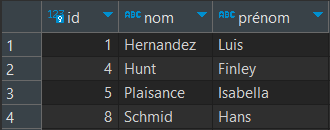

### Point 2
Le prix minimum, maximum et moyen pour passer une nuit dans une chambre d'hôtel dans la ville de Montreux.
```sql
SELECT min(prixParNuit) AS "Minimum", max(prixParNuit) AS "Maximum", avg(prixParNuit) AS "Moyen" FROM chambre
	INNER JOIN Hôtel ON Chambre.idhôtel = Hôtel.id
	INNER JOIN Ville ON Ville.id = Hôtel.idville
WHERE Ville.nom = 'Montreux';
```

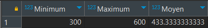

### Point 3
Les clients qui n'ont fait des réservations que dans des hôtels de 2 étoiles ou moins.
```sql
SELECT Client.id, Client.nom, Client.prénom
FROM Client
	 INNER JOIN Réservation ON Client.id = Réservation.idClient
	 INNER JOIN Hôtel ON Réservation.idChambre = Hôtel.id
GROUP BY Client.id, Client.nom, Client.prénom
HAVING COUNT(Réservation) FILTER (WHERE Hôtel.nbEtoiles > 2) = 0;
```

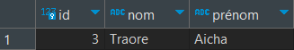

### Point 4
Le nom des villes avec au moins un hôtel qui n'a aucune réservation.
```sql
SELECT DISTINCT Ville.nom
FROM Hôtel
	INNER JOIN Ville ON Ville.id = Hôtel.idVille
	LEFT JOIN Réservation ON Réservation.idChambre = Hôtel.id
WHERE Réservation IS NULL;
```

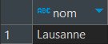
<div style="page-break-after: always;"></div>

### Point 5
L'hôtel qui a le plus de tarifs de chambres différents.
```sql
SELECT Hôtel.nom AS nom_hôtel, COUNT(DISTINCT Chambre.prixParNuit) AS nb_tarifs_différents
FROM Hôtel
	INNER JOIN Chambre ON Hôtel.id = Chambre.idHôtel
GROUP BY Hôtel.id, Hôtel.nom
ORDER BY nb_tarifs_différents DESC
LIMIT 1;
```

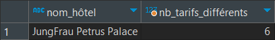

### Point 6
Les clients ayant réservé plus d'une fois la même chambre. Indiquer les clients et les chambres concernées.
```sql
SELECT Client.id, Client.nom, Hôtel.nom AS nom_hotel, Réservation.numéroChambre FROM Client 
	INNER JOIN Réservation ON Réservation.idClient = Client.id
	INNER JOIN Hôtel ON Hôtel.id = Réservation.idChambre
GROUP BY Client.id, Hôtel.id, Réservation.numéroChambre
HAVING COUNT(*) >= 2;
```

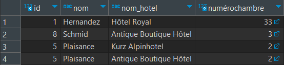

### Point 7
Les membres de l'hôtel "Kurz Alpinhotel" qui n'y ont fait aucune réservation depuis qu'ils en sont devenus membre.
```sql
SELECT DISTINCT Client.id, Client.nom, Client.prénom FROM Client 
	INNER JOIN Membre ON Membre.idClient = Client.id 
	INNER JOIN Hôtel ON Membre.idHôtel = Hôtel.id
	LEFT JOIN Réservation ON Membre.idclient = Réservation.idclient AND 				Réservation.dateréservation > Membre.depuis
WHERE Hôtel.nom = 'Kurz Alpinhotel'
GROUP BY Client.id
HAVING count(Réservation) = 0;
```

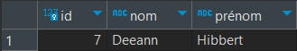
<div style="page-break-after: always;"></div>

### Point 8
Les villes, classées dans l'ordre décroissant de leur capacité d'accueil totale (nombre de places des lits de leurs hôtels).
```sql
SELECT Ville.nom FROM Ville
	INNER JOIN Hôtel ON Ville.id = Hôtel.idVille
	INNER JOIN Chambre ON Hôtel.id = Chambre.idHôtel
	INNER JOIN Chambre_Equipement ON Chambre.idHôtel = Chambre_Equipement.idChambre
	INNER JOIN Lit ON Chambre_Equipement.idEquipement = Lit.idEquipement
GROUP BY Ville.nom
ORDER BY SUM(Lit.nbPlaces) DESC;
```

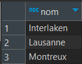

### Point 9
Les hôtels avec leur classement par ville en fonction du nombre de réservations.
```sql
SELECT Hôtel.nom, Ville.nom,
RANK() OVER (PARTITION BY Ville.nom 
  ORDER BY SUM(
    CASE 
      WHEN Réservation.idchambre = Hôtel.id 
      THEN 1 
      ELSE 0 
    END) 
  DESC) AS Classement_par_ville
FROM Hôtel
	INNER JOIN Ville ON Hôtel.idville = Ville.id
	LEFT JOIN Réservation ON Hôtel.id = Réservation.idchambre
GROUP BY Ville.nom, Hôtel.nom
ORDER BY Ville.nom, Classement_par_ville;
```

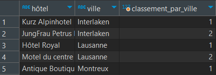
<div style="page-break-after: always;"></div>

### Point 10
Lister, par ordre d'arrivée, les prochaines réservations pour l'hôtel "Antique Boutique Hôtel" en indiquant si le client a obtenu un rabais.
```sql
SELECT Client.id, Client.nom, Client.prénom, 
  (Membre IS NOT NULL AND Réservation.dateréservation > Membre.depuis) AS Rabais, Hôtel.nom AS Hôtel, Chambre.numéro AS numérochambre, 
  TO_CHAR(Réservation.datearrivée,'DD.MM.YYYY') AS datearrivée,
  TO_CHAR(Réservation.dateréservation,'DD.MM.YYYY') AS dateréservation, Réservation.nbnuits, Réservation.nbpersonnes
FROM Réservation
	INNER JOIN Client ON Réservation.idclient = Client.id
	INNER JOIN Chambre ON Réservation.idchambre = Chambre.idhôtel AND Réservation.numérochambre = Chambre.numéro
	INNER JOIN Hôtel ON Réservation.idchambre = Hôtel.id AND Hôtel.nom = 'Antique Boutique Hôtel'
	LEFT JOIN Membre ON Client.id = Membre.idclient AND Hôtel.id = Membre.idhôtel
WHERE Réservation.datearrivée > now()
ORDER BY Réservation.datearrivée;
```

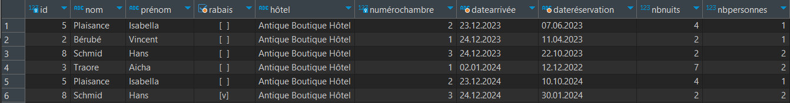

### Point 11
Les réservations faites dans des chambres qui ont un nombre de lits supérieur au nombre de personnes de la réservation.
```sql
SELECT Client.id, Client.nom, Client.prénom, Hôtel.nom AS Hôtel, Chambre.numéro AS numérochambre, 
  TO_CHAR(Réservation.datearrivée,'DD.MM.YYYY') AS datearrivée,
  TO_CHAR(Réservation.dateréservation,'DD.MM.YYYY') AS dateréservation, Réservation.nbnuits, Réservation.nbpersonnes
FROM Réservation
	INNER JOIN Client ON Réservation.idclient = Client.id
	INNER JOIN Chambre ON Réservation.idchambre = Chambre.idhôtel 
  AND Réservation.numérochambre = Chambre.numéro
	INNER JOIN chambre_equipement ON Chambre.idhôtel = chambre_equipement.idchambre 
  AND Chambre.numéro = chambre_equipement.numérochambre 
  AND chambre_equipement.quantité > Réservation.nbpersonnes
	INNER JOIN Hôtel ON Réservation.idchambre = Hôtel.id
ORDER BY Hôtel, Chambre.numéro;
```

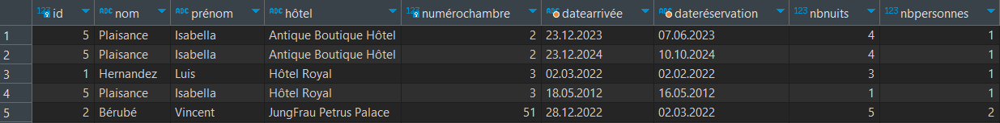
<div style="page-break-after: always;"></div>

### Point 12
Les chambres à Lausanne ayant au moins une TV et un lit à 2 places.
```sql
SELECT Hôtel.nom, Chambre.numéro 
FROM Chambre
	INNER JOIN Hôtel ON Chambre.idhôtel = Hôtel.id
	INNER JOIN Ville ON Hôtel.idville = Ville.id AND Ville.nom = 'Lausanne'
	INNER JOIN chambre_equipement ON Chambre.idhôtel = chambre_equipement.idchambre AND Chambre.numéro = chambre_equipement.numérochambre
	LEFT JOIN Equipement ON chambre_equipement.idequipement = Equipement.id AND Equipement.nom = 'TV'
LEFT JOIN Lit ON chambre_equipement.idequipement = Lit.idequipement AND Lit.nbplaces > 1
GROUP BY Hôtel.nom, Chambre.numéro
HAVING count(Equipement) > 0 AND max(Lit.nbPlaces) > 1;
```

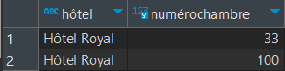

### Point 13

Pour l'hôtel "Hôtel Royal", lister toutes les réservations en indiquant de combien de jours elles ont été faites à l'avance (avant la date d'arrivée) ainsi que si la réservation a été faite
en tant que membre de l'hôtel. Trier les résultats par ordre des réservations (en 1er celles faites le plus à l’avance), puis par clients (ordre croissant du nom puis du prénom).
```sql
SELECT Client.id, Client.nom, Client.prénom, 
  (Membre IS NOT NULL AND Réservation.dateréservation > Membre.depuis) AS Membre, Hôtel.nom AS Hôtel, Chambre.numéro AS numérochambre, 
  TO_CHAR(Réservation.datearrivée,'DD.MM.YYYY') AS datearrivée, 
  TO_CHAR(Réservation.dateréservation,'DD.MM.YYYY') AS dateréservation, 
  (Réservation.datearrivée - Réservation.dateréservation) AS Avance, Réservation.nbnuits, Réservation.nbpersonnes
FROM Réservation
	INNER JOIN Client ON Réservation.idclient = Client.id
	INNER JOIN Chambre ON Réservation.idchambre = Chambre.idhôtel AND Réservation.numérochambre = Chambre.numéro
	INNER JOIN Hôtel ON Réservation.idchambre = Hôtel.id AND Hôtel.nom = 'Hôtel Royal'
	LEFT JOIN Membre ON Client.id = Membre.idclient AND Hôtel.id = Membre.idhôtel
ORDER BY Avance DESC, Client.nom, Client.prénom;
```

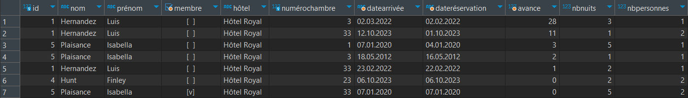
<div style="page-break-after: always;"></div>

### Point 14
Calculer le prix total de toutes les réservations faites pour l'hôtel "Hôtel Royal".
```sql
SELECT sum((Chambre.prixparnuit * Réservation.nbnuits) * (100 - (CASE 
WHEN Membre IS NOT NULL AND Réservation.dateréservation > Membre.depuis 
	THEN Hôtel.rabaismembre 
	ELSE 0
END))/ 100)
FROM Réservation
	INNER JOIN Hôtel ON Réservation.idChambre = Hôtel.id
	INNER JOIN Chambre ON Hôtel.id = Chambre.idHôtel AND Chambre.numéro = Réservation.numérochambre
	INNER LEFT JOIN Membre ON Hôtel.id = Membre.idhôtel AND Membre.idclient = Réservation.idclient
WHERE Hôtel.nom = 'Hôtel Royal';
```

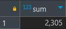
<div style="page-break-after: always;"></div>

## Partie 2 - CI
### Script pour la CI
```sql
CREATE OR REPLACE FUNCTION controleNomLit() RETURNS TRIGGER
LANGUAGE plpgsql
AS $$
BEGIN
    IF NOT EXISTS (
      SELECT 1 FROM Equipement 
      WHERE id = NEW.idEquipement AND lower(nom) LIKE '%lit%'
    ) THEN
      RAISE EXCEPTION 'Le nom doit contenir le mot lit';
    END IF;
    RETURN NEW;
END $$;

CREATE TRIGGER CI_LIT BEFORE INSERT OR UPDATE ON Lit
FOR EACH ROW WHEN (NEW.idEquipement IS NOT NULL)
EXECUTE FUNCTION controleNomLit();
```

### Tests effectués
Nous avons essayer d'ajouter des équipements avec des noms variés contenant parfois le mot lit et parfois pas.
```sql
INSERT INTO Equipement(nom) VALUES ('Li Queen size');
INSERT INTO Equipement(nom) VALUES ('Lits Queen size');
INSERT INTO Equipement(nom) VALUES ('Literie Queen size');
INSERT INTO Equipement(nom) VALUES ('liT Queen size');
INSERT INTO Equipement(nom) VALUES ('LIT Queen size');
INSERT INTO Equipement(nom) VALUES ('lit Queen size');
INSERT INTO Equipement(nom) VALUES ('Li t Queen size');
INSERT INTO Equipement(nom) VALUES ('Queen Lit size');
INSERT INTO Equipement(nom) VALUES ('Queen LIT size');
INSERT INTO Equipement(nom) VALUES ('Queen lit size');
INSERT INTO Equipement(nom) VALUES ('Queen litière size');
INSERT INTO Equipement(nom) VALUES ('Queen Li t size');
INSERT INTO Equipement(nom) VALUES ('Queen Li size');
INSERT INTO Lit(idEquipement, nbPlaces) VALUES (8, 2);
INSERT INTO Lit(idEquipement, nbPlaces) VALUES (9, 2);
INSERT INTO Lit(idEquipement, nbPlaces) VALUES (10, 2);
INSERT INTO Lit(idEquipement, nbPlaces) VALUES (11, 2);
INSERT INTO Lit(idEquipement, nbPlaces) VALUES (12, 2);
INSERT INTO Lit(idEquipement, nbPlaces) VALUES (13, 2);
INSERT INTO Lit(idEquipement, nbPlaces) VALUES (14, 2);
INSERT INTO Lit(idEquipement, nbPlaces) VALUES (15, 2);
INSERT INTO Lit(idEquipement, nbPlaces) VALUES (16, 2);
INSERT INTO Lit(idEquipement, nbPlaces) VALUES (17, 2);
INSERT INTO Lit(idEquipement, nbPlaces) VALUES (18, 2);
INSERT INTO Lit(idEquipement, nbPlaces) VALUES (19, 2);
INSERT INTO Lit(idEquipement, nbPlaces) VALUES (20, 2);
```

<div style="page-break-after: always;"></div>

Les résultats des insertions suivants sont les suivantes:
- Erreur ("Li ")
- Ok
- Ok
- Ok
- Ok
- Ok
- Erreur ("Li t")
- Ok
- Ok
- Ok
- Ok
- Erreur ("Li t")
- Erreur ("Li ")
<div style="page-break-after: always;"></div>

## Conclusion
La première partie nous a permis de nous familiariser avec la base de données ainsi que son contenu. Notre démarche, consistant à écrire une requête et ensuite contrôler que son résultat soit correcte, nous a permis de bien avancer et d'être sûr de nos résultats.

Pour la deuxième partie nous avons employé un trigger pour le contrôle d'une insertion. Les tests ont vérifié le bon fonctionnement de ce contrôle avec des cas variés et ressemblant à des erreurs possibles.
Les résultats de notre script de test sont parfaitement accordés avec nos attentes.

Ce laboratoire nous a donc permis d'approfondir nos connaissances en SQL ainsi que d'apprendre à repartir d'un travail déjà existant pour y apporter des améliorations ou nouvelles fonctionnalitées.