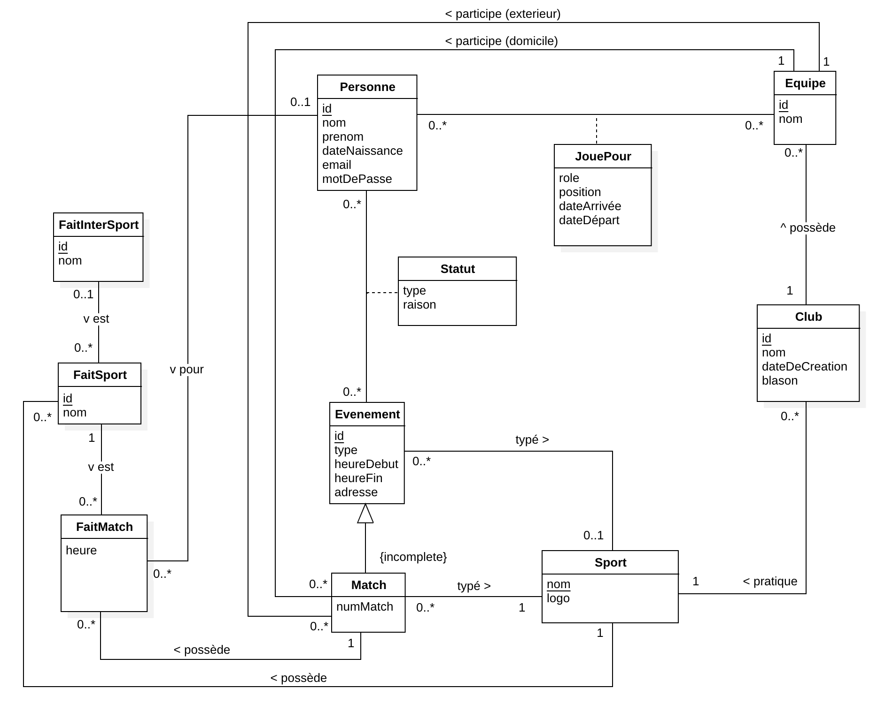

# Documentation
**Table des matières**
- [Base de donnée](#base-de-donnée)
	- [Schéma EA](#schéma-ea)
	- [Contraintes d&#39;intégrité](#contraintes-dintégrité)
	- [Choix d&#39;implémentation](#choix-dimplémentation)

# Base de donnée
## Schéma EA

## Contraintes d'intégrité
- Tous les faits de match doivent être du même sport que le match auquel ils appartiennent.
- Chaque personne ne peut être présente au même moment que pour une équipe.
- Une équipe ne peut participer qu'aux matchs du même sport.
- Une équipe peut avoir des faits de matchs uniquement pour les matchs auxquels elle participe.
- Une équipe ne peut avoir que des positions du même sport.
- Une personne peut participer à un évènement seulement si elle fait partie d'une équipe participant au même évènement.
- L'heure de fin d'un événement ne peut être que supérieur à l'heure de début de celui-ci.
- Un match doit avoir deux équipes distinctes.
- L'attribut `type` d'un évènement ne peut être nul uniquement dans le cas d'un match.
- `FaitSport` a un nom uniquement quand c'est un fait qui est précisé pour le sport en question. Quand il fait partie des Fait intersport il reprend le nom de ce fait.
## Choix d'implémentation

- Nous avons lié les évènements directement aux personnes plutôt qu'aux équipes. Ceci de sorte à pouvoir évoluer le domaine d'application de la base de données pour pouvoir par exemple, inviter des personnes externes à une équipe pour participer à un évènement ou bien n'inviter que certaines personnes de l'équipe.
- Match est le seul type d'évènement qui hérite d'évènement car les autres évènements, comme par exemple des entrainement ou des sorties d'équipe, se résument tous de la même façon.
- Nous n'avons aucun fait de match qui est associé à plus d'une personne. Ceci car nous pouvons toujours décomposer les faits en deux parties, e.g. changement rentrant, changement sortant.
- Les faits de match ne sont pas forcément liés à une personne car il y a des faits tels que le début et la fin du match qui ne s'applique pas à une personne individuelle.
- Les attributs "type" de `Evenement` et `JouePour` seront des enums.
- Nous allons faire confiance à l'utilisateur pour le choix de quels personnes vont à chaque évènement de sorte à ne pas restreindre les choix de personnes/positions par évènement.
- Le type de sport qui pourra être intégré dans la base-de-données sera des sports d'équipes avec des matchs prenant une équipe contre une autre.
- Les données qui seront fourni à l'utilisateur seront:
	- Les sports possibles
	- Les faits de sport et donc les faits par sport
	- Les types d'évènements