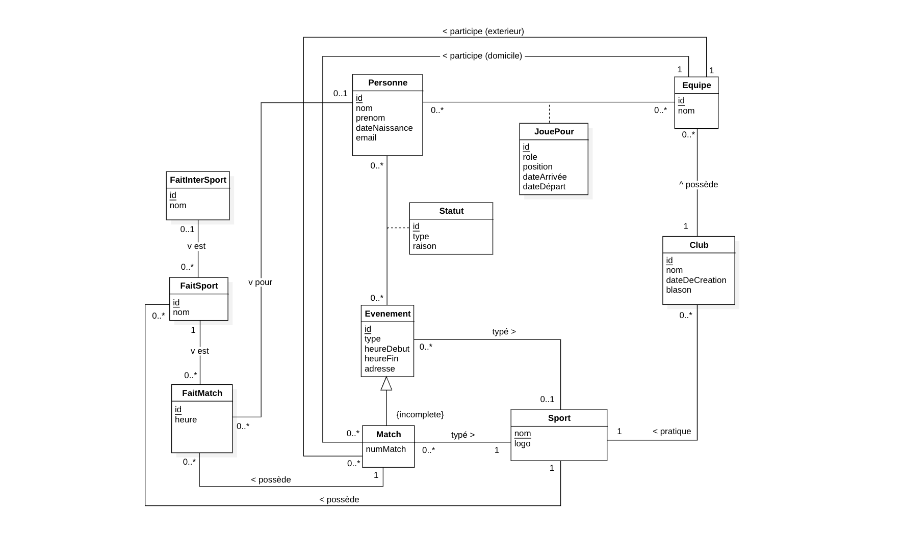
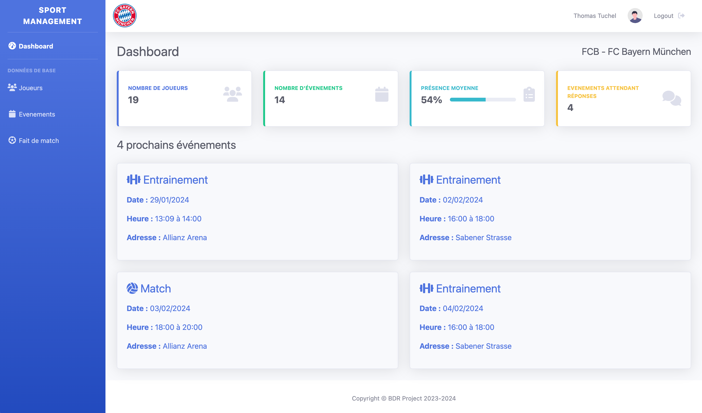
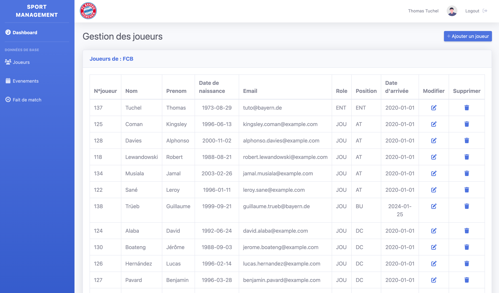
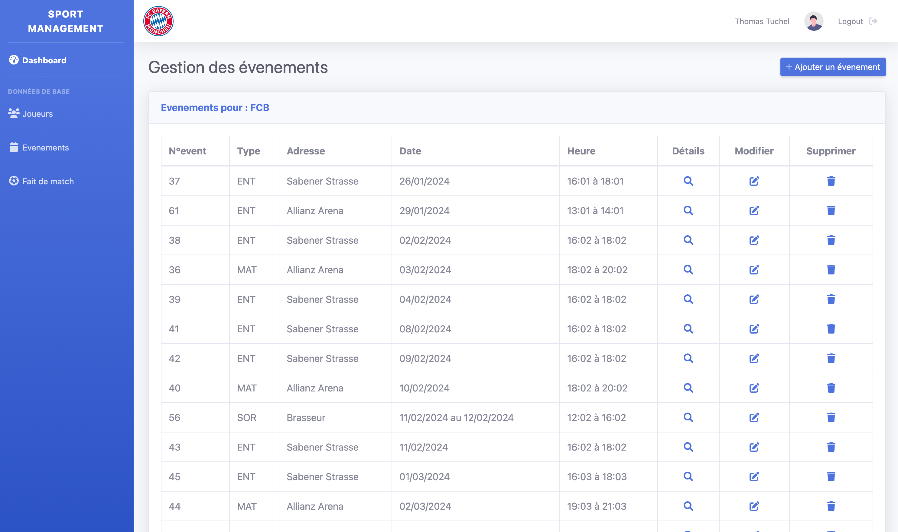
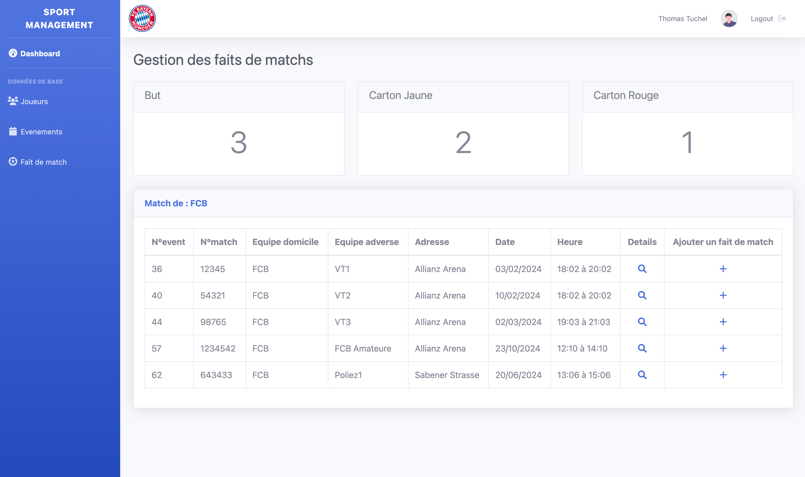
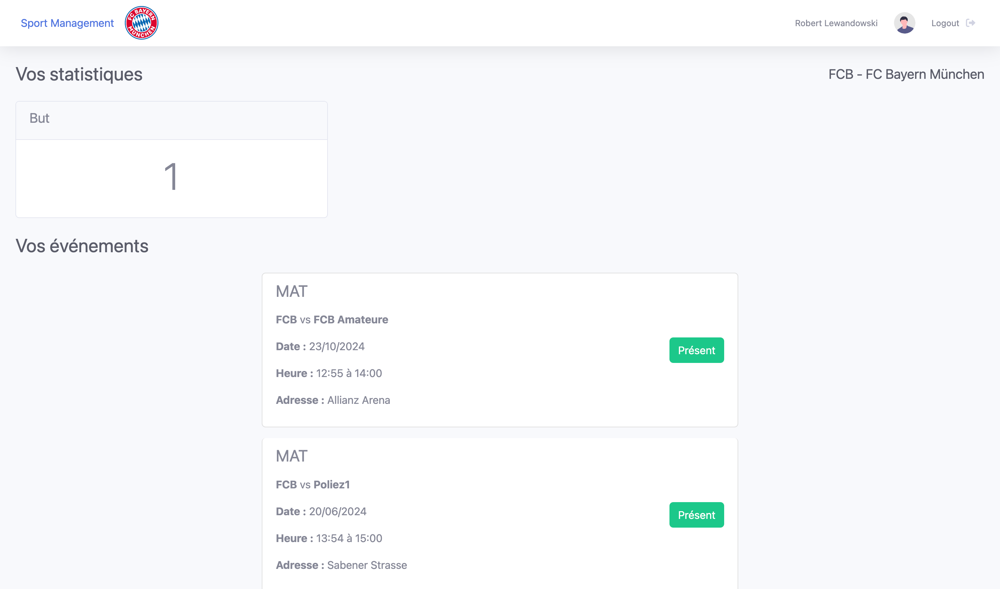

<div align="center">
  <h1 align="center">SPORTS MANAGEMENT</h1>
  <h3>Amène ton équipe au sommet !</h3>
  <p style="text-align:center"> 
    Gwendal Piemontesi, Calum Quinn, Guillaume Trüeb
  </p>
</div>

<div style="page-break-after: always;"></div>

**Table des matières**
- [Introduction](#introduction)
	- [Cahier des charges](#cahier-des-charges)
- [Base de données](#base-de-donn%C3%A9es)
	- [Schéma EA](#sch%C3%A9ma-ea)
	- [Contraintes d'intégrité](#contraintes-dint%C3%A9grit%C3%A9)
	- [Modèle relationnel](#mod%C3%A8le-relationnel)
	- [Choix d'implémentation](#choix-dimpl%C3%A9mentation)
- [Application](#application)
	- [Description de l’application](#description-de-lapplication)
		- [Section de connexion](#section-de-connexion)
		- [Section pour entraîneurs](#section-pour-entra%C3%AEneurs)
			- [Détails des joueurs](#d%C3%A9tails-des-joueurs)
			- [Détails des événements](#d%C3%A9tails-des-%C3%A9v%C3%A9nements)
			- [Détails des faits de match](#d%C3%A9tails-des-faits-de-match)
			- [Options supplémentaires](#options-suppl%C3%A9mentaires)
				- [Modifier les détails du profil](#modifier-les-d%C3%A9tails-du-profil)
		- [Section pour joueurs](#section-pour-joueurs)
- [Manuel utilisateur](#manuel-utilisateur)
- [Bugs connus](#bugs-connus)
	- [Améliorations possibles](#am%C3%A9liorations-possibles)
- [Conclusion](#conclusion)

<div style="page-break-after: always;"></div>

# Introduction
Ce projet vise à créer une base de données et une application cliente permettant de consommer les informations provenant de la base de données. Il est réalisé sous forme de "sprints" et est amélioré à chaque itération. Chaque étape concernant la base de données est validée par le professeur.

Le projet est structuré en 3 dossiers principaux pour segmenter correctement notre projet. Vous trouverez d'abord le dossier `app`, contenant l'interface graphique utilisant le framework Laravel avec le langage PHP. Ensuite, le dossier `database` stocke le schéma EA, le modèle relationnel ainsi que les 3 scripts pour créer les tables, ajouter les triggers et insérer les données. Enfin, le dossier `doc` contient toutes les différentes documentations rendues au fur et à mesure du projet.

Notre implémentation consiste en une application de gestion pour les membres de clubs sportifs, axée sur la gestion d'équipe pour les entraîneurs et la gestion des présences pour les joueurs, avec un focus sur le football et le volleyball.

## Cahier des charges
Les fonctionnalités de base discutées lors de l'élaboration du cahier des charges sont les suivantes :
- Créer une équipe et la personnaliser (choisir son nom, son blason, ses infos)
- Ajouter ou supprimer des membres
- Créer des événements, des entraînements ou des matches
- Pouvoir créer et avoir un bilan des présences des événements
- Gérer de manière approfondie les équipes de football et de volley
- Adapter les possibilités pour des matches et autres statistiques liés aux matches en fonction des sports

En ce qui concerne l'interface web, nous avions identifié les aspects suivants :
- Visualiser les présences de ses joueurs
- ~Prendre des décisions concernant les compositions pour les matchs~
- Gérer certaines statistiques globales
  - Taux de présence (événement / semaine / mois / saison)
- Gérer les statistiques de matchs
  - Buts
  - Pénalités (carton jaune / rouge)
  - Changements
  - ~Temps de jeu~

Après des discussions avec le professeur et l'assistante, nous avons conclu que mettre en place à la fois la gestion des compositions de match et des statistiques des matchs serait trop complexe. Par conséquent, nous avons décidé de nous concentrer uniquement sur les statistiques de matchs et d'offrir une plus grande flexibilité dans la gestion des positions sur le terrain en utilisant simplement un champ textuel. De plus, ce choix nous a empêchés d'intégrer la gestion des statistiques du temps de jeu, car cela aurait nécessité de connaître les joueurs présents sur le terrain.

<div style="page-break-after: always;"></div>

# Base de données

## Schéma EA


## Contraintes d'intégrité
- Une équipe ne peut participer qu'aux matchs du même sport.
- Tous les `FaitMatch` doivent être du même sport que le match auquel ils appartiennent.
- Un joueur ne peut appartenir qu'à une seule équipe de sport à la fois.
- L'heure d'un `FaitMatch` doit être comprise entre le début et la fin du match.
- La date de l'événement (dans les attributs `heureDebut` et `heureFin`) doit être égale ou antérieure à la date de création des deux clubs des deux équipes s'affrontant.
- Chaque personne ne peut être présente qu'à un seul moment pour une seule équipe.
- Une équipe peut avoir des `FaitMatch` uniquement pour les matchs auxquels elle participe.
- L'`heureFin` d'un événement ne peut être que supérieure à l'`heureDebut` de celui-ci.
- Un match doit opposer deux équipes distinctes.
- La `dateArrivee` dans `JouePour` ne doit pas être postérieure à la `dateDepart`, ni antérieure à la `dateDeCreation` du club, ni antérieure à la date de naissance du joueur en question.
- Un `FaitMatch` ne peut être enregistré que par une personne présente au match en question.
- Le statut de présence à un événement passé n'est plus modifiable.

## Modèle relationnel
- Sport(<u>nom</u>,logo)
- Club(<u>id</u>,id,nom,dateDeCreation,blason,nomSport) 
  - Club.nomSport ref Sport.nom
  - Club.nom NOT NULL
  - Club.dateDeCreation NOT NULL
  - Club.nomSport NOT NULL
- Equipe(<u>id</u>,nom,idClub) 
  - Equipe.idClub ref Club.id
  - Equipe.nom NOT NULL
  - Equipe.idClub NOT NULL
- Personne(<u>id</u>,nom,prenom,dateDeNaissance,email)
  - Personne.nom NOT NULL
  - Personne.prenom NOT NULL
  - Personne.dateDeNaissance NOT NULL
  - Personne.email UNIQUE NOT NULL
- JouePour(<u>id</u>,idEquipe,idPersonne,role,position,dateArrivee,dateDepart) 
  - JouePour.idEquipe ref Equipe.id 
  - JouePour.idPersonne ref Personne.id
  - JouePour.idEquipe NOT NULL
  - JouePour.role NOT NULL
  - JouePour.position NOT NULL
  - JouePour.dateArrivee NOT NULL
- Evenement(<u>id</u>,type,heureDebut,heureFin,adresse,nomSport) 
  - Evenement.nomSport ref Sport.nom
  - Evenement.heureDebut NOT NULL
  - Evenement.heureFin NOT NULL
  - Evenement.adresse NOT NULL
  - Evenement.nomSport NOT NULL
- Statut(<u>id</u>,idPersonne,idEvenement,type,raison)
  - Statut.idPersonne ref Personne.id
  - Statut.idEvenement ref Evenement.id
  - Statut.idPersonne NOT NULL
  - Statut.idEvenement NOT NULL
  - Statut.type NOT NULL
- Match(<u>idEvenement</u>,numMatch,idEquipeDomicile,idEquipeAdversaire,nomSport) 
  - Match.idEvenement ref Evenement.id 
  - Match.idEquipeDomicile ref Equipe.id
  - Match.idEquipeAdversaire ref Equipe.id
  - Match.nomSport ref Sport.nom
  - Match.numMatch UNIQUE NOT NULL
  - Match.nomSport NOT NULL
- FaitInterSport(<u>id</u>,nom)
  - FaitInterSport.nom UNIQUE NOT NULL
- FaitSport(<u>id</u>,nom,idFaitInterSport,nomSport)
  - FaitSport.idFaitInterSport ref FaitInterSport.id
  - FaitSport.nomSport ref Sport.nom
  - FaitSport.nom NOT NULL
  - FaitSport.idFaitInterSport NOT NULL
  - FaitSport.nomSport NOT NULL
- FaitMatch(<u>id</u>,heure,idFaitSport,idPersonne,idMatch) 
  - FaitMatch.idFaitSport ref FaitSport.id
  - FaitMatch.idPersonne ref Personne.id
  - FaitMatch.idMatch ref Match.idEvenement
  - FaitMatch.heure NOT NULL
  - FaitMatch.idFaitSport NOT NULL
  - FaitMatch.idMatch NOT NULL


## Choix d'implémentation
Voici les choix importants de notre implémentation :

- Nous avons décidé d'implémenter les actions possibles en 3 classes différentes :
  - FaitInterSport : regroupe les faits généraux communs à tous les sports implémentés dans la base (par exemple, début, fin, pause,...)
  - FaitSport : reprend les faits de `FaitInterSport` et y ajoute les faits spécifiques à ce sport non partagés par les autres (par exemple, carton rouge/jaune, porté,...)
  - FaitMatch : reprend les faits de `FaitSport` lorsqu'ils ont lieu pendant le match en question
- Nous avons lié les évènements directement aux personnes plutôt qu'aux équipes, ceci afin de permettre l'évolution du domaine d'application de la base de données. Par exemple, cela permet d'inviter des personnes externes à une équipe pour participer à un évènement ou de n'inviter que certaines personnes de l'équipe.
- Match est le seul type d'évènement qui hérite d'évènement, car les autres évènements, tels que des entraînements ou des sorties d'équipe, se résument tous de la même façon.
- Nous n'avons aucun fait de match qui est associé à plus d'une personne, car nous pouvons toujours décomposer les faits en deux parties, par exemple, changement rentrant, changement sortant.
- Les faits de match ne sont pas forcément liés à une personne, car il y a des faits tels que le début et la fin du match qui ne s'appliquent pas à une personne individuelle.
- Nous ferons confiance à l'utilisateur pour le choix des personnes qui participent à chaque évènement, afin de ne pas restreindre les choix de personnes/positions par évènement.
- Le type de sport qui pourra être intégré dans la base de données sera des sports d'équipes avec des matchs opposant une équipe à une autre.
- Les données fournies à l'utilisateur incluront :
  - Les sports possibles
  - Les faits de sport et donc les faits par sport
  - Les types d'évènements

<div style="page-break-after: always;"></div>

# Application 
## Description de l’application 
Notre application de gestion d'équipe de sport est structurée en 3 grandes sections.
- **Section de connexion**
  - Permet de se connecter
  - Permet de créer un nouveau compte

- **Section pour les entraîneurs**
  - Affiche des statistiques de base
  - Gère les joueurs de l'équipe
  - Gère les événements de l'équipe
  - Gère les actions survenues lors des matchs

- **Section pour les joueurs**
  - Affiche des statistiques de base
  - Permet d'annoncer la présence aux événements

### Section de connexion
Pour se connecter à l'application, il suffit d'utiliser l'adresse e-mail des utilisateurs enregistrés dans le système. Si le compte n'existe pas, vous pouvez cliquer sur `Créer un compte` et remplir le formulaire pour créer un compte.


### Section pour entraîneurs
Une fois connecté en tant qu'entraîneur, vous accéderez à une page d'accueil regroupant différentes statistiques ainsi que les 4 prochains événements concernant les joueurs de l'équipe. Ces données offrent une vue globale sur l'investissement des joueurs dans l'équipe.


#### Détails des joueurs
Cette page présente tous les détails des joueurs faisant partie de l'équipe. La vue est dynamique et dépend de la date actuelle, car les joueurs ajoutés à une date définie seront automatiquement affichés dans cette interface une fois la date définie atteinte. Depuis cette interface, vous pouvez modifier le rôle et la position du joueur, et vous avez la possibilité de retirer le joueur de l'équipe.


#### Détails des événements
Cette page affiche une liste des événements prévus pour l'équipe en question. Vous pouvez également créer de nouveaux événements, voir les détails complets, modifier les informations de l'événement, et enfin supprimer un événement selon votre choix.


#### Détails des faits de match
Cette page présente la liste des matchs ainsi qu'un bouton permettant d'ajouter des faits de match sur les matchs organisés pour l'équipe.


#### Options supplémentaires
##### Modifier les détails du profil
Il est possible de modifier les détails du profil de la personne connectée. Pour cela, il faut cliquer sur le nom de la personne en haut à droite de l'écran, à côté du bouton `logout`.

### Section pour joueurs
Cette page offre une vue possible en tant que joueur ou en tant que personne sans rôle. Nous avons ajouté la possibilité pour un joueur qui ne fait plus partie d'une équipe de se connecter pour consulter ses statistiques ainsi que l'historique des derniers événements.


<div style="page-break-after: always;"></div>

# Manuel utilisateur
Pour démarrer l'application web il vous faudra commencer pour télécharger en local le dossier contenant tout notre projet. Une fois téléchargé déplacez-vous avec le terminal dans le dossier téléchargé puis utilisez la commande suivante : 
```sh
cd app
docker-compose up --build
```
Cela permettera de démarrer à la fois l'application web ainsi que la base de donnée. Le fichier `docker-compose.yml` est une extension de celle fournie par M. Rossat pour utiliser postgre SQL depuis Docker. Nous avons donc juste ajouté la partie dédié à l'application Laravel.

Une fois que la commande est lancée, le script d'insertion Init.sql se trouvant dans le dossier `database` sera automatiquement lancé à la première éxecution du `docker-compose.yml`.

>[!important]
>Pour tester l'application vous pouvez vous connecter avec l'adresse `tuto@bayern.de`. Celui-ci occupe le poste d'entraineur et vous pourrez donc passer au travers de données déjà insérée! Si vous souhaitez avoir une vue de joueur, vous pouvez vous connecter avec `harry.kane@example.com`.

<div style="page-break-after: always;"></div>

# Bugs connus
Une de nos contraintes, "Une personne peut avoir une présence à un événement seulement si elle fait partie d'une équipe participant au même événement", n'a pas été implémentée. En principe, proposer à un joueur de répondre présent ou non à un événement auquel lui et son équipe ne participent pas ne devrait jamais arriver. Nous avons donc pris la décision de ne pas l'implémenter.

Etant donné qu'il était explicitement demandé de ne pas utiliser d'ORM, la sécurité de certaines requêtes peut-être compromise ou non gérée. C'est pourquoi il se peut que certains bugs au niveau de l'interface n'aient pas pu être découvert. Dans le cas d'une implémentation en production je conseillerais fortement d'utiliser ces processus bien sécurisés et testés.

## Améliorations possibles
Une des premières améliorations que nous pourrions faire (celle-ci n'était pas définie dans notre cahier des charges) mais serait de créer un rôle supplémentaire qui serait le rôle de président de club et qui pourrait librement créer des équipes ainsi que d'y assigner des entraineurs. La structure de notre projet rend l'implémentation de cette fonctionnalité possible car lors de la conception nous avions anticipé l'idée d'ajouter de nouveaux rôles plus ou moins précis.

Une autre amélioration possible serait de gérer les positions sur le terrain et de pouvoir simplifier la séléction des joueurs en fonction des positions disponible. Cela a été discuté au début du projet, mais nous avons choisi de nous axer sur les statistiques des matchs à la place.

<div style="page-break-after: always;"></div>

# Conclusion
Ce projet nous a permis d'apprendre à utiliser des outils pour la création et la gestion de bases de données, ainsi que des applications web pour l'implémentation de ces bases de données. Il nous a également donné l'opportunité de mettre en pratique une grande partie des notions vues dans le cours. Cela a été grandement enrichissant et stimulant.

Il nous a aussi mis dans des conditions "d'entreprise", par exemple, avec la notion de planning et de deadline, car nous avons dû nous organiser pour rendre les livrables dans les délais demandés ainsi que pour le projet final.

Le rendu final de notre travail correspond en partie au cahier des charges original et implémente la plupart des fonctionnalités souhaitées. Certains ajustements pourraient être envisagés dans une version ultérieure, tels que la prise en compte de plus de sports, l'ajout d'un administrateur pour la création d'équipes, simplement avoir plus de données sur les matches/événements pour pouvoir faire des statistiques plus poussées et permettre aux équipes d'être plus performantes.