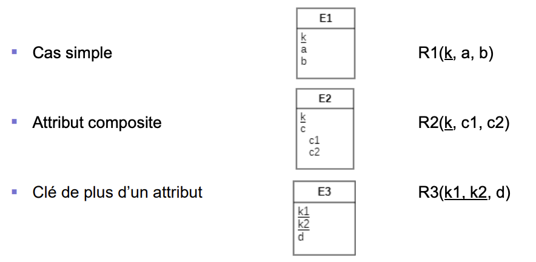

**Table des matières**
- [Définition](#d%C3%A9finition)
- [Types d’entité forts](#types-dentit%C3%A9-forts)
- [Types d'entité faibles](#types-dentit%C3%A9-faibles)
- [Héritages](#h%C3%A9ritages)
	- [Types](#types)
- [Associations binaires 1:1](#associations-binaires-11)
	- [Association 1:1 (0..1 d'un côté)](#association-11-01-dun-c%C3%B4t%C3%A9)
	- [Association 1:1 (1 des 2 côtés)](#association-11-1-des-2-c%C3%B4t%C3%A9s)
	- [Association 1:1 (0..1 des 2 côtés)](#association-11-01-des-2-c%C3%B4t%C3%A9s)
	- [Cas spéciaux](#cas-sp%C3%A9ciaux)
- [Associations binaires 1:N](#associations-binaires-1n)
	- [Avec attribut](#avec-attribut)
- [Associations binaires N:M](#associations-binaires-nm)
- [Attributs multivalué](#attributs-multivalu%C3%A9)
- [Associations n-aires](#associations-n-aires)
- [Associations réflexives](#associations-r%C3%A9flexives)
	- [Association N:M](#association-nm)
	- [Association 1:N](#association-1n)
## Définition
>[!important]
>Il existe 9 règles permettant de convertir les modèles EA en modèles relationnel. Les voici listées : 

## Types d’entité forts
- Créer une relation R avec tous les attributs simples, et les composantes simples des attributs composites, de E
- La clé primaire de E devient celle de R

## Types d'entité faibles
- Créer une relation R contenant tous les attributs de E
- La clé est celle du type d’entité fort avec le(s) attribut(s) discriminant(s)

Type d'entité fort :   R1(<u>k1</u>, a)
Type d'entité faible: R2(<u>k1, k2</u>, b)
Contrainte de FK:     R2.k1 référence R1.k1

## Héritages
- Le type d’entité parent se transforme comme un type d’entité normal (fort)
- Les types d’entité enfant deviennent des relations avec leurs attributs et comme clé primaire celle de leur parent (qui est donc aussi une clé étrangère **unique et not null**)

### Types
- Pour rappel, il existe 4 types d’héritage possibles:
	- {complete, overlapping}
	- {complete, disjoint}
	- {incomplete, overlapping}
	- {incomplete, disjoint}

>[!important]
>L’exemple ci-dessus est de type {incomplete, overlapping}, c’est le seul cas qui n’a pas besoin de contraintes supplémentaires une fois transformé en relation.
>**PS** : Pour les autres cas il faudra utiliser des triggers et/ou des CHECK

## Associations binaires 1:1
### Association 1:1 (0..1 d'un côté)
- Il faut identifier le type d’entité qui a obligatoirement une référence sur l’autre (cardinalité minimale de 1) et:
	- En faire une relation qui a comme clé étrangère la clé primaire de l’autre type d’entité
	- Tous les attributs de l’association sont mis dans cette relation

### Association 1:1 (1 des 2 côtés)
- Idem que le cas précédent sauf qu’ici on doit choisir un des deux types d’entité

- En choisissant E1:
	- R2(<u>k2</u>, b)
	- R1(<u>k1, k2</u>, a, c) 
	- R1.k2 référence R2.k2, R1.k2 UNIQUE et NOT NULL

### Association 1:1 (0..1 des 2 côtés)
- Identique au cas précédent, il faut choisir un type d’entité

- En choisissant E2:
	- R1(<b>k1</b>, b) 
	- R2(<b>k2, k1</b>, a, c)
	- R2.k1 référence R1.k1, R2.k1 UNIQUE

>[!important]
>À noter que cette fois la clé étrangère n’est pas NOT NULL (car la cardinalité minimale est de 0)

### Cas spéciaux
- Un type d’entité est considéré comme "spécial" s’il n’a pas de clé explicite (enfant d’héritage par exemple)
- Les règles vues précédemment, dans lesquelles il faut choisir un type d’entité, sont valides si les 2 types d’entité sont normaux ou si les 2 sont spéciaux

>[!attention]
>Si un des deux types d’entité est "spécial" alors c’est lui qu’il faut prendre pour y faire migrer les attributs

- Dans cet exemple c’est donc automatiquement E2 qui est choisi pour la transformation de l’association binaire
![[S0/PiecesJointes/Pasted image 20231024182440.png]]
- R1(<u>k1</u>, a)
- R3(<u>k3</u>, c)
- R2(<u>k1</u>, k3, b, d)
- R2.k1 référence R1.k1
- R2.k3 référence R3.k3, R2.k3 UNIQUE et NOT NULL

## Associations binaires 1:N
- De base, on applique la même règle que pour les associations 0..1 – 1
![[S0/PiecesJointes/Pasted image 20231024183204.png]]
- R2(<u>k2</u>, b)
- R1(<u>k1, k2</u>, a)
- R1.k2 référence R2.k2

- Si la cardinalité de E1 vaut 1 (schéma de gauche), il faut ajouter: R1.k2 NOT NULL 

- La différence avec la transformation d’une association 0..1 – 1 est que cette fois la clé étrangère n’est pas UNIQUE car la cardinalité max du type référencé (E2) vaut n (au lieu de 1)

### Avec attribut
**Variante 1**
- Si l’association a au moins un attribut, le cas avec une cardinalité de 1 se transforme de manière identique
![[S0/PiecesJointes/Pasted image 20231024183417.png]]
- R2(<u>k2</u>, b)
- R1(<u>k1</u>, k2, a, c)
- R1.k2 référence R2.k2, R1.k2 NOT NULL

**Variante 2**
![[S0/PiecesJointes/Pasted image 20231024183610.png]]
>[!warning]
>- La variante 1 impose plus de vérifications/contraintes au SGBD: 
>	- Si R1.k2 est NULL alors R1.c doit aussi l’être 
>	- Si R1.k2 n’est pas NULL et que c est un attribut obligatoire, alors il faut garantir qu’il n’est pas non plus NULL

## Associations binaires N:M
- Les deux types d’entité se transforment comme des types d’entité normaux (forts)
- L’association devient une relation:
	- Contenant tous ses éventuels attributs
	- Ayant pour clé primaire la combinaison des clés des 2 types d’entité (+ ses éventuels attributs définis comme membre de la clé primaire)
![[S0/PiecesJointes/Pasted image 20231024184129.png]]
- R1(k1, a)
- R2(k2, k3, b)
- R3(k1, k2, k3, c)
- R3.k1 référence R1.k1
- (R3.k2, R3.k3) référence (R2.k2, R2.k3)

## Attributs multivalué
- Possède un attribut (monovalué) qui correspond à l’attribut multivalué
- A comme clé la combinaison de son attribut et de la clé du type d’entité auquel il appartenait
![[S0/PiecesJointes/Pasted image 20231024215736.png]]
- R1(k, b)
- R2(k, a)
- R2.k référence E.k

## Associations n-aires
- Comme 1ère étape on transforme l’association n-aire en n associations binaires 1:N en: 
	1. Transformant l’association en type d’entité et en lui attribuant une clé artificielle
	2. Créant une association de type 1 à plusieurs depuis ce type d’entité vers chacun des types d’entités qui étaient reliés par l’association Le côté 1 est mis du côté des types d’entité de base
![[S0/PiecesJointes/Pasted image 20231024220348.png]]

- Ensuite il faut appliquer la règle de transformation des associations 1:N vue précédemment
![[S0/PiecesJointes/Pasted image 20231024220507.png]]
- R1(k1, a)
- R2(k2)
- R3(k3, b)
- R4(k4, k1, k2, k3)
- R4.k1 référence E1.k1, R4.k1 NOT NULL
- R4.k2 référence E2.k2, R4.k2 NOT NULL
- R4.k3 référence E3.k3, R4.k3 NOT NULL

## Associations réflexives
### Association N:M
- La transformation est la même que pour toutes les association N:M
![[S0/PiecesJointes/Pasted image 20231024221341.png]]
### Association 1:N
![[S0/PiecesJointes/Pasted image 20231024222007.png]]
- La variante 2 est recommandée notamment parce qu'elle:
	- Sépare mieux les concepts (par ex. lien de parenté du slide précédent)
	- Est supportée par tous les SGBD au niveau des options de contrainte d’intégrité référentielle (ON UPDATE CASCADE n’est par exemple pas supporté par MySQL dans la variante 1)
