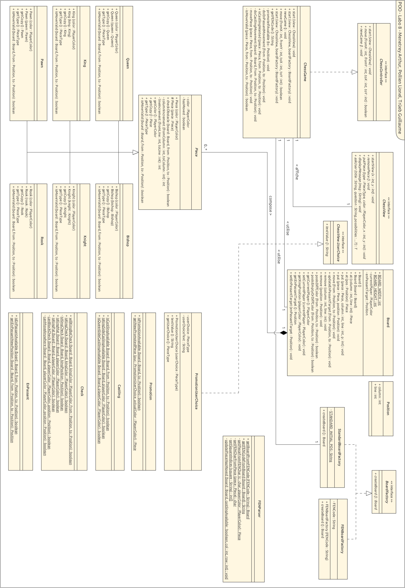

                                            
# Laboratoire 8 - Echecs

**Ménétrey Arthur, Polien Lionel, Trüeb Guillaume**
Rendu le 17 janvier 2024

**Table des matières**
- [Introduction](#introduction)
- [Diagramme](#diagramme)
- [Implémentation](#impl%C3%A9mentation)
	- [Gestion des déplacements](#gestion-des-d%C3%A9placements)
		- [Pions](#pions)
		- [Tours](#tours)
		- [Cavaliers](#cavaliers)
		- [Fous](#fous)
		- [Dames](#dames)
		- [Rois](#rois)
	- [Gestion des mouvements spéciaux](#gestion-des-mouvements-sp%C3%A9ciaux)
		- [Petit et grand roque](#petit-et-grand-roque)
			- [Conditions](#conditions)
			- [Implémentations](#impl%C3%A9mentations)
			- [Remarque](#remarque)
		- [Prise en passant](#prise-en-passant)
			- [Conditions](#conditions)
			- [Implémentation](#impl%C3%A9mentation)
		- [Promotion](#promotion)
			- [Conditions pour la promotion](#conditions-pour-la-promotion)
			- [Implémentation](#impl%C3%A9mentation)
		- [Gestion échec et mat et match nuls](#gestion-%C3%A9chec-et-mat-et-match-nuls)
			- [Implémentation](#impl%C3%A9mentation)
- [Rapport de test](#rapport-de-test)
	- [Notation FEN](#notation-fen)
	- [Génération des images](#g%C3%A9n%C3%A9ration-des-images)

## Introduction
Dans ce laboratoire il nous était demandé d'implémenter un jeu d'échec avec un certains nombres de règles définies dans le chapitre [implémentation](#impl%C3%A8mentation). De plus il était de demandé de fournir un rapport ainsi qu'un diagramme UML contenant la liste et définition des classes que nous avons implémentée dans notre jeu d'échecs.

## Diagramme

## Implémentation

### Gestion des déplacements
Dans la gestion des déplacements nous avons choisi de définir une **classe abstraite** nommée `Piece` contenant des propriétés partagées entre toutes les pièces de l'échiquier ainsi que des méthodes à la fois abstraites, ou définies.

Nous avons notamment une méthode `checkObstacle` permettant de contrôler si une autre pièce est présente entre la position initiale et finale de la pièce déplacée. Ce check est nécessaire pour toutes les pièces à l'exception du **cavalier** qui lui, passe au dessus des autres pièces du jeu.
#### Pions
Le déplacement du pion est déterminé par plusieurs conditions:

1. **Direction de déplacement**: Le pion peut se déplacer vers le haut (ligne inférieure vers la ligne supérieure) pour les pièces blanches et vers le bas (ligne supérieure vers la ligne inférieure) pour les pièces noires.  
2. **Déplacement diagonal (prise)**: Le pion peut se déplacer en diagonale d'une case s'il y a une pièce adverse à cette position. Cependant, le pion ne peut se déplacer en diagonale que s'il y a une pièce ennemie à la case de destination ou s'il s'agit d'un mouvement En Passant.
3. **Double déplacement initial**: Le pion a la possibilité de se déplacer de deux cases vers l'avant lors de son premier mouvement, à condition qu'il n'y ait pas d'obstacle sur son chemin.
4. **Déplacement d'une case vers l'avant**: En dehors du premier mouvement, le pion peut se déplacer d'une seule case vers l'avant, à condition que la case de destination soit libre.

Le code prend en compte ces règles pour déterminer si un mouvement est valide. Il vérifie la direction, la présence d'obstacles, les mouvements diagonaux autorisés et les mouvements En Passant. Le code utilise également une classe `EnPassant` pour vérifier si un mouvement En Passant est disponible.
#### Tours
La tour peut se déplacer verticalement ou horizontalement sur l'échiquier. Pour qu'un déplacement soit valide, la ligne de départ ou la colonne de départ doit être la même que la ligne ou la colonne d'arrivée. De plus, la case de destination doit être vide ou contenir une pièce de couleur adverse. La méthode `checkObstacle` est utilisée pour vérifier s'il y a des obstacles sur le chemin de la tour.

En d'autres termes, la tour se déplace en ligne droite, capturant une pièce ennemie si elle se trouve sur la case d'arrivée, et ne peut pas sauter par-dessus d'autres pièces.
#### Cavaliers
Le mouvement du cavalier est caractérisé par un saut de deux cases dans une direction (horizontale ou verticale), suivi d'un saut d'une case perpendiculaire. Pour que le déplacement soit considéré valide, la différence en colonne (en valeur absolue) doit être de 2 et la différence en ligne (en valeur absolue) de 1, ou vice versa.

Contrairement aux autres pièces, le cavalier a la faculté de sauter par-dessus d'autres pièces sur l'échiquier. La méthode `posIsEmptyOrDiffColor` est employée pour vérifier si la case de destination est soit vide, soit occupée par une pièce adverse. Le cavalier adopte une trajectoire unique en réalisant des sauts en forme de L, lui permettant ainsi de contourner les pièces présentes sur l'échiquier.
#### Fous
Le fou se déplace en diagonale sur l'échiquier. Pour qu'un déplacement soit valide, la différence en colonne doit être égale à la différence en ligne. De plus, la case de destination doit être vide ou contenir une pièce de couleur adverse. La méthode `checkObstacle` est utilisée pour vérifier s'il y a des obstacles sur la diagonale de déplacement du fou. Il ne peut pas sauter par-dessus d'autres pièces.
#### Dames
La reine combine les mouvements de la tour et du fou. Elle peut se déplacer en ligne droite (verticalement, horizontalement) ou en diagonale. Pour qu'un déplacement soit valide, la différence en colonne doit être égale à la différence en ligne (diagonale), ou l'une des différences doit être nulle (mouvement horizontal ou vertical). De plus, la case de destination doit être vide ou contenir une pièce de couleur adverse. La méthode `checkObstacle` est utilisée pour vérifier s'il y a des obstacles sur le chemin de déplacement de la reine.

#### Rois
Le roi peut se déplacer d'une seule case dans n'importe quelle direction : verticalement, horizontalement ou en diagonale. De ce fait, nous n'avons pas besoin de contrôler qu'il n'y ait pas d'obstacle dans son déplacement. La seule condition est que la case d'arrivée soit vide ou que un pion de la couleur adverse soit dessus. Cependant, le roi est la pièce maitresse et lors de son déplacement nous devons nous assurer qu'il ne se retrouve pas dans une position illicite, c'est à dire en echec. C'est pourquoi la classe `ChessGame` possède une méthode `isMoveValid` qui à pour objectif de contrôler ce genre de déplacement notamment en appelant la fonction `Check.willKingBeCheck(...)` qui permet de contrôler que le roi ne sera pas en échec.

### Gestion des mouvements spéciaux
Nous avons décidé de gérer les différents mouvements dans des classes contenant des méthodes `statiques` servant d'outil pour les différents contrôles à effectuer pour ces mouvements spéciaux. 
#### Petit et grand roque
La classe Castling est une composante essentielle dans un système de jeu d'échecs, responsable de vérifier la faisabilité d'un roque. Le roque est un mouvement spécial dans le jeu d'échecs qui implique à la fois le roi et une tour. Le roi va alors bouger de deux cases vers une tour et cette dernière va se positionner à côté de lui côté centre du plateau.

##### Conditions
- La tour et le roi ne doivent pas avoir bougé.
- Aucune autre pièce ne doit se trouver entre le roi et la tour.
- Lors du roque, le roi ne doit en aucun cas être en échec au début du mouvement, pendant le déplacement ou à sa position finale.

##### Implémentations
La méthode principale, isCastlingAvailable, examine une série de conditions pour déterminer si le roque est possible dans une situation donnée. Elle évalue d'abord si la pièce impliquée est effectivement un roi, si elle n'a pas été déplacée auparavant dans la partie et que la destination choisie par le joueur est bien deux cases à côté du roi. Ensuite, elle détermine s'il s'agit d'un grand ou d'un petit roque et à partir de cette information, elle peut en déduire la position de la tour. La méthode va ensuite vérifier qu'à la position de la tour il s'agit bien d'une tour et qu'elle n'a pas bougé. Ensuite, elle vérifie qu'aucune pièce ne se trouve entre le roi et la tour et que le roi n'est pas en échec, ne traverse pas une case attaquée, et ne se met pas en échec en effectuant le roque.

Ensuite, dans la méthode move de ChessGame.java, nous allons vérifier si le joueur veut effectivement effectuer un roque (avec la méthode isCastlingWanted) et si le roque est voulu et qu'il est valable, alors nous avons une autre méthode doCastlingMovement qui va s'occuper du déplacement de la tour et le roi aux bonnes positions. 

##### Remarque
Un aspect important de la méthode isCastlingAvailable est qu'elle exige explicitement que les positions from et to spécifiées correspondent à un roi et une case deux cases plus loin que celle du roi. Cette approche diffère d'une validation basée sur un déplacement de deux, trois ou 4 cases du roi (cliquer sur le roi et ensuite sur la tour), une méthode utilisée par chess.com, le site de référence concernant les échecs en ligne. Dans notre implémentation, le joueur doit sélectionner explicitement le roi et une case deux cases plus loin pour initier un roque.

Dans la class Castling, il y a deux autres méthodes isQueenSideCastlingAvailable et isKingSideCastlingAvailable, qui sont là pour faciliter l'implémentation des tests mais ne sont pas utilisées pour le jeu.

#### Prise en passant
La règle d'en passant est une exception intéressante dans les règles des échecs qui concerne le mouvement des pions. Elle permet à un joueur de capturer le pion adverse qui vient d'avancer de deux cases à côté de son propre pion, en avançant ce dernier d'une seule case.

##### Conditions
- Le pion adverse doit avancer de deux cases depuis sa position de départ.
- Le pion qui effectue l'en passant doit immédiatement suivre le mouvement du pion adverse.

##### Implémentation
La classe `EnPassant` possède deux méthodes. La première permet de vérifier si la prise en passant est possible en lui donnant le board de jeu ainsi que les positions de départ et d'arrivée. La deuxième permet de récupérer la position de la pièce se faisant manger par la prise en passant, cette méthode permet au controleur du jeu de la retirer du plateau quand celle-ci est mangée.

#### Promotion
La promotion de pièce est une règle spéciale des échecs qui offre la possibilité à un pion d'être promu à une pièce de rang supérieur lorsqu'il atteint la rangée opposée de l'échiquier.

##### Conditions pour la promotion
- Un pion peut être promu à n'importe quelle pièce lorsqu'il atteint la rangée opposée à sa position de départ.
- Le joueur peut choisir de promouvoir le pion en n'importe quelle pièce, à l'exception du roi. Les options habituelles incluent la dame, la tour, le fou ou le cavalier.
- La classe `Promotion` lancera une erreur de type `InvalidParameterException` si elle reçoit une demande de promotion en roi ou en pion

##### Implémentation
L'implémentation de la fonction de promotion nécessite l'utilisation de deux classes une nommée `PromotionUserChoice` implémentant l'interface `ChessView.UserChoice` qui permettera d'afficher un message sur l'interface graphique offrant le choix de la pièce remplacent le pion promu. Une autre classe nommée `Promotion` contenant deux fonctions statiques. La première permet de contrôler que la promotion est possible. La deuxième permet de récupérer une instance du nouveau type de pièce qui doit remplacer le pion promu. 

#### Gestion échec et mat et match nuls
L'échec survient lorsqu'un roi peut être attaqué par une pièce adverse. Si le roi d'un joueur est en échec, alors le joueur est obligé de jouer un coup mettant sont roi hors d'échec.
Un roi dit mat est un roi qui n'a aucun coup lui permettant de sortir d'un échec. Lorsque le roi d'un jour est mat, le joueur perds la partie.

Il existe aussi un cas ou la partie peut se finir en match nulle par exemple lors d'un pat. Un pat survient lorsqu'un joueur n'a aucun coup valide à jouer. Si un joueur n'a plus aucun coup valide lors de son tour, alors la partie est nulle.

Notre programme implémente la classe `Check` mettant à disposition plusieurs méthode afin d'implémenter ces deux mécaniques.

##### Implémentation
Au coeur de la gestion des échec et du pat se trouve la méthode `isKingCheck` qui permet de savoir si le roi de la couleur donnée est en échec dans la position donnée.
Cette vérification s'effectue en ittérant parmi toutes les pièces adverses en jeu et en vérifiant si elle peuvent manger le roi.
Si une pièce satisfait cette condition cela veut dire que le roi est en échec.

De cette méthode en découle trois autres :

- `willKingBeCheck` qui permet de vérifier si un roi sera en échec après un coup donné
- `isKingMat` qui va tester si un joueur est mat. Cette méthode teste tout les coups possible jusqu'à en trouver un le sortant d'échec. Dans le cas ou aucun coup n'a été trouvé, le roi est mat.
- `isKingPat` qui va tester si un joueur est pat. Dans le cas ou le joueur n'a aucun coup valide, le joueur est pat.

## Rapport de test
Un programme de test a été crée afin de tester different cas de figure aux échecs. 
Ce programme va tester un coup dans une position initiale puis vérifier si le résultat obtenu est le même que celui attendu.
Un rapport markdown sera généré contenant les différents résultats des tests ainsi que des images d'illustration afin de visualiser la position initiale, résultante et attendue du test.
Notez qu'afin de générer les images nous utilisons un site web, soit [ChessVision](chessvision.ia), qui met a disposition un endpoint de génération d'images.

Vous trouverez les différents résultats des tests à cette adresse : [**Rapport de test**](tests.md)

### Notation FEN
La notation FEN ou Forsyth–Edwards Notation est une notation standard positionnelle des échecs. 
Elle décrit un état d'une partie d'échecs comprenant :
- La position des pièces
- La disponibilités du petit et grand roque pour chacun des joueurs
- L'éventuelle case disponible pour la prise en passant
- Le nombre de demi-coups pour [la règle des 50 coups](https://fr.wikipedia.org/wiki/R%C3%A8gle_des_50_coups)
- Le nombre de coups total

Dans notre cas, nous n'avons ni implémenté le nombre de coups ou de demi coups par simplicité et car cela n'était pas nécessaire au bon fonctionnement des tests.
En effet notre jeu d'échecs n'implémente pas la règle des 50 coups et fera fi du nombre de coups joués et de demi-coups.

Notez que la notation FEN ne supporte pas le stockage des positions précédentes et ne permet donc pas de détecter une triple répétition pouvant entrainer une partie nulle.
(voir : [La nulle dans le cas général](https://fr.wikipedia.org/wiki/Nulle#:~:text=La%20nulle%20par%20consentement%20mutuel,faisant%20appel%20%C3%A0%20l'arbitre.))

La classe `FENParser` contient deux méthodes publiques. 
La première, `getBoardFromFENCode`, permet d'obtenir une instance de la classe `Board`.
La seconde, `getFENCodeFromBoard`, permet d'obtenir le code FEN à partir d'une instance de la classe `Board`.

### Génération des images
Le site [chessvision.ia](https://chessvision.ai/) mets à disposition différents outils et documents sur le jeu d'échecs divers et variés. (Recceuils de problèmes, Documents d'apprentissage, analyse de position, etc...)
Il permet aussi de générer des images à partir d'une position FEN en appondant une position FEN à l'addresse [fen2image.chessvision.ai/](https://fen2image.chessvision.ai/) comme par exemple [fen2image.chessvision.ai/rnbqkbnr/pppppppp/8/8/8/8/PPPPPPPP/RNBQKBNR%20w%20KQkq%20-](https://fen2image.chessvision.ai/rnbqkbnr/pppppppp/8/8/8/8/PPPPPPPP/RNBQKBNR%20w%20KQkq%20-)

Nous utilisons donc ce procédé afin de générer puis télécharger les images dans le dossier [doc/img/tests](../doc/img/tests) qui seront ensuite utilisées dans le [rapport de test](tests.md).

L'implémentation de cette fonctionnalité se trouve dans la méthode `SaveToPNG` de la classe `FENImageDownloader` qui prends en paramètre un code FEN ainsi qu'un chemin de fichier.