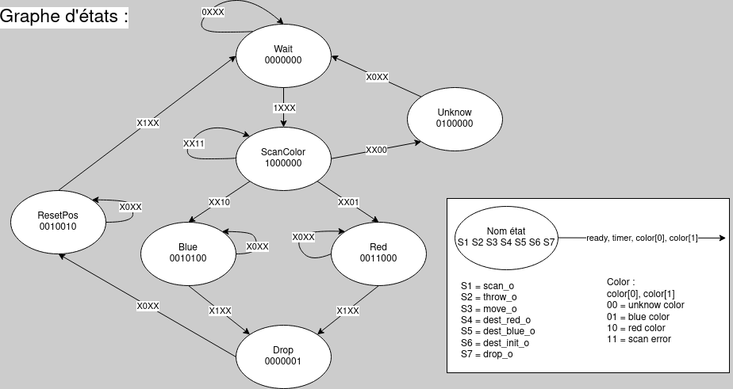
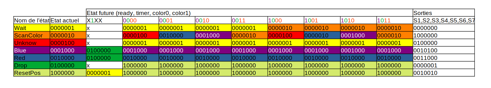

# Laboratoire 4 Bras robot 
Gwendal Piemontesi
Guillaume Trüeb

## Analyse des entrées/sorties
Tout d'abord, il s'agit ici d'une machine de Moore, où les sorties ne dépendent donc en aucun cas directement des entrées. 

Voici les 4 entrées du système :

- `ready_i` : est à 1 lorsque le bras est prêt à scanner une forme.
- `color_i` : indique la couleur de la forme scannée et éventuellement si une erreur se produit (table de vérité ci-dessous).
- `clk_i`   : Signal d'horloge du système (pas directement utile pour savoir l'état future).
- `reset_i` : Réinitialisation asynchrone de l'ensemble du système.
- `timer_i` : Nous allons devoir ajouter cette entrée nous-mêmes elle nous permettra de suivre la progression du bras dans ses déplacements, nous donnant ainsi la possibilité de changer d'état dans certains cas.

Voici la table de vérité pour `color_i` :

| Valeur | Signification           |
|--------|-------------------------|
| 00     | Couleur indéterminée    |
| 01     | Rouge                   |
| 10     | Bleu                    |
| 11     | Erreur                  |

Voici les 7 sorties de notre système:

- `scan_o` : est à 1 lorsque le système est prêt à scanner une forme.
- `throw_o` : est à 1 lorsque le scan détecte une couleur non connue.
- `move_o` : est à 1 lorsque le bras doit se déplacer.
- `dest_red_o` : est à 1 en même temps que `move_o` pour se déplacer vers le compartiment rouge.
- `dest_blue_o` : est à 1 en même temps que `move_o` pour se déplacer vers le compartiment bleu.
- `dest_init_o` : est à 1 en même temps que `move_o` pour se déplacer vers la position initiale.
- `drop_o` : est à 1 lorsque le bras doit relâcher la pièce qu'il tient dans le bon compartiment.
  
## Élaboration du graphe des états
Selon les comportements suivants du bras :

- Lorsqu'une pièce arrive devant le bras, le capteur de détection (ready_i) monte son signal à '1'.   
- Pour permettre la détection d'une couleur, le signal scan_o doit être mis à '1'.   
- Le scan effectué par le capteur de couleur se fait en un seul coup d'horloge du système.   
- Si la couleur est inconnue, alors le signal throw_o doit être mis à '1' pendant un cycle.   
- Si une des couleurs est connue, alors le bras doit se diriger au-dessus du compartiment correspondant.   
- Tant qu'il y a une erreur de scan, le système doit continuer à scanner jusqu'à obtenir l'un des trois résultats attendus.   
- Pour déplacer le bras, le signal move_o ainsi que l'un des signaux dest_red_o, dest_blue_o ou dest_init_o doivent être mis à '1' afin d'indiquer la direction du mouvement. Ceci pendant toute la durée du déplacement.   
- Le bras met du temps à se déplacer. Il est nécessaire d'attendre la fin du déplacement du bras.   
- Une fois au-dessus de l'un des compartiments, le signal drop_o doit être mis à '1' durant un cycle d'horloge avant de replacer le bras dans sa position initiale (en prenant à nouveau en compte le temps de déplacement du bras).   

Il nous a été possible d'élaborer un graphe d'état que voici.

1. **Wait :**
   - Attente de l'arrivée d'une pièce devant le bras.
   - Dès que le capteur de détection (ready_i) détecte une pièce, passer à l'état ScanColor.

2. **ScanColor :**
   - Mettre le signal scan_o à '1' pour permettre la détection de la couleur.
   - Le scan de couleur se fait en un seul coup de clock.
   - Tant qu'il y a une erreur de scan, continuer à scanner jusqu'à obtenir l'un des trois résultats attendus.

3. **Unknow :**
   - Si la couleur est inconnue, activer le signal throw_o pendant un cycle et retourner à l'état Wait.

4. **Blue/Red :**
   - Si la couleur est connue, diriger le bras au-dessus du compartiment correspondant.
   - Mettre le signal move_o à '1' et l'un des signaux dest_red_o, dest_blue_o, ou dest_init_o pour indiquer la direction du mouvement.
   - Maintenir ces signaux activés pendant toute la durée du déplacement du bras.
   - Attendre la fin du déplacement du bras avant de passer à l'état suivant.

5. **Drop :**
   - Une fois au-dessus de l'un des compartiments, activer le signal drop_o pendant un cycle d'horloge.

6. **ResetPos :**
   - Retourner à l'état initial en prenant en compte le temps de déplacement du bras.

## Table des états
Voici la table des étas du système:

## Equations des états futures et sorties
Ces équations ont pu être déduites de la table des états.

| Équation états future  | Expression                                                                       |
|------------------------|----------------------------------------------------------------------------------|
| $$Wait^+$$             | $$Wait \cdot \overline{ready} +  ResetPos \cdot timer + Unknow$$                 |
| $$ScanColor^+$$        | $$Wait \cdot ready + ScanColor \cdot color0 \cdot color1$$                       |
| $$Unknow^+$$           | $$ScanColor \cdot \overline{color0} \cdot \overline{color1}$$                    | 
| $$Blue^+$$             | $$Blue \cdot \overline{timer} + ScanColor \cdot color0 \cdot \overline{color1}$$ |
| $$Red^+$$              | $$Red \cdot \overline{timer} + ScanColor \cdot \overline{color0} \cdot color1$$  |
| $$Drop^+$$             | $$Blue \cdot timer + Red \cdot timer$$                                           |
| $$ResetPos^+$$         | $$ResetPos \cdot \overline{timer} + Drop$$                                       |

