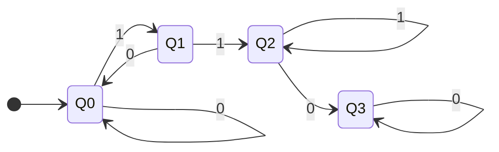

# Exercice 1
^(0.*0|1.*1)$
(0(0|1)0)|(1(0|1)1)|0|1

# Exercice 2

```mermaid
stateDiagram-v2
    direction LR
    [*] --> Q0
    Q0 --> Q0 : 0
    Q0 --> Q1 : 1
    Q1 --> Q0 : 0
    Q1 --> Q2 : 1
    Q2 --> Q2 : 1
    Q2 --> Q3 : 0
    Q3 --> Q3 : 0
```