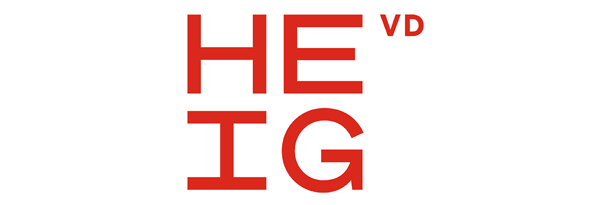

## Presentation
As a computer science student in the [HEIG-VD](https://heig-vd.ch) I have all my resume that I made during this journey. I share it with pleasure to help all the others student to to succeed in their studies.

## Structure
The folders structure is made by semester. S1 represent the first semester of the first year and S3 represent the first semester of the second year. SE represent the summer semester called as `HES d'été`. Inside thoses folders you will find all the academic subjects I had during the semester.

**As I was doing the HEIG in part time you will maybe not find the academic subject in the same semester as you!**

>[!warning]
>As I used Notion for the S1 you won't find any documentation about this semester. It's in my ToDo list!
>As I used Obsidian for the S2 and S3 you won't find any documentation about this semester. It's in my Todo list!
>...
